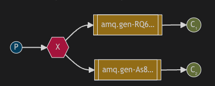

## Rabbitmq основные понятия
**RabbitMQ** — это открытое программное обеспечение для посредничества сообщений (message broker) в системах распределенной обработки сообщений. RabbitMQ реализует протокол AMQP (Advanced Message Queuing Protocol) и предоставляет надежную, гибкую и масштабируемую платформу для отправки, получения и обработки сообщений между различными компонентами приложений.
<details>
<summary><h4>Основные понятия</h4></summary>




* **Broker**: RabbitMQ работает как посредник (broker) между отправителем и получателем сообщений. Он принимает сообщения от отправителя и маршрутизирует их к соответствующим получателям.
* **Message**: Сообщение представляет собой единицу данных, которая передается между отправителем и получателем через брокера. Оно содержит полезную нагрузку или информацию, которую требуется передать.
* **Queue**: Очередь используется для хранения сообщений внутри RabbitMQ. Обычно сообщения поступают в очередь от отправителя и извлекаются получателем. Каждое сообщение в очереди ожидает своей обработки.
* **Producer**: Отправитель — это компонент или приложение, которое отправляет сообщения в RabbitMQ для последующей обработки.
* **Consumer**: Потребитель — это компонент или приложение, которое принимает или получает сообщения из очереди RabbitMQ для обработки.
* **Exchange**: Обменник (exchange) управляет маршрутизацией сообщений в RabbitMQ. Он принимает сообщения от производителей и передает их в соответствующие очереди на основе определенных правил маршрутизации.
* **Binding**: Привязка (binding) связывает обменник и очередь вместе. Она определяет, какие сообщения должны быть маршрутизированы из обмена в очередь на основе определенного ключа маршрутизации (routing key).
* **Channel**: Канал (channel) представляет собой логическое соединение между клиентом и брокером в RabbitMQ. Клиенты создают каналы для отправки и получения сообщений, что помогает уменьшить накладные расходы на установку соединения.

</details>

### Поддерживаемые протоколы
RabbitMQ поддерживает несколько протоколов, которые могут быть использованы для взаимодействия с брокером. Вот некоторые из основных протоколов, доступных для использования в RabbitMQ:
<details>
<summary><h4>Протоколы</h4></summary>

* Advanced Message Queuing Protocol (AMQP): AMQP - это открытый и мощный протокол для обмена сообщениями, который RabbitMQ поддерживает изначально. Он предоставляет стандартизированное и надежное средство взаимодействия между клиентами и брокером. RabbitMQ полностью реализует AMQP и может использоваться с клиентами, поддерживающими этот протокол.
* Simple Message Transfer Protocol (SMTP): RabbitMQ также может работать как почтовый сервер, поддерживающий обмен сообщениями по протоколу SMTP. Этот протокол обеспечивает механизм доставки сообщений по электронной почте. SMTP не является основным протоколом RabbitMQ, но он доступен для использования.
* Streaming Text Oriented Messaging Protocol (STOMP): STOMP - это текстовый протокол для обмена сообщениями, который также поддерживается RabbitMQ. Он предоставляет простой и гибкий механизм взаимодействия с брокером и поддерживается различными языками программирования.
* MQTT: RabbitMQ предоставляет плагин MQTT, который позволяет использовать протокол MQTT (Message Queuing Telemetry Transport), популярный протокол для обмена сообщениями в сетях с ограниченной пропускной способностью и низкой задержкой. Этот плагин обеспечивает совместимость с MQTT-клиентами и позволяет взаимодействовать с RabbitMQ по протоколу MQTT.

</details>

## Отличительные особенности(можно сравнить с Kafka)
**RabbitMQ** и **Apache Kafka** - это два разных системы посредничества сообщений (message brokers), которые имеют различные принципы работы и области применения. Вот основные отличия между ними:

<details>
<summary><h4>Особенности</h4></summary>

* Протокол и модель сообщений:
  * RabbitMQ: Использует протокол AMQP (Advanced Message Queuing Protocol). Работает по модели очереди сообщений, где сообщения отправляются в определенные очереди и получаются из них. Распространенная схема работы в синхронном или асинхронном режиме.
  * Kafka: Использует свой собственный протокол, основанный на записях (records). Работает на основе публикации-подписки (publish-subscribe) и хранит сообщения в пределах определенного времени (retention period) или объема хранилища (storage).
* Устойчивость и хранение сообщений:
  * RabbitMQ: Гарантирует сохранность сообщений с помощью подтверждений доставки (delivery confirms) и может хранить сообщения на диске в случае временных сбоев.
  * Kafka: Гарантирует сохранность сообщений на основе асинхронного и компактного хранения журналов (logs), что обеспечивает устойчивость и возможность перечитывания сообщений в любой момент времени.
Скорость и масштабируемость:
  * RabbitMQ: Хорошо подходит для случаев, где требуется обработка большого количества небольших сообщений с низкой задержкой (low latency).
  * Kafka: Оптимизирован для обработки больших объемов сообщений (high-throughput) с высокой скоростью записи и чтения. Обычно используется в случаях, когда требуется потоковая обработка больших объемов данных.
* Отказоустойчивость и репликация:
  * RabbitMQ: Поддерживает режимы репликации и кластеризации, позволяющие обеспечить отказоустойчивость и горизонтальное масштабирование.
  * Kafka: Хорошо масштабируется горизонтально и обеспечивает высокую отказоустойчивость с помощью репликации и шардирования данных.
* Использование в микросервисной архитектуре:
  * RabbitMQ: Широко используется в микросервисных архитектурах для обмена сообщениями между компонентами, обеспечивая гибкость в маршрутизации и коммуникации.
  * Kafka: Часто используется в случаях обработки данных в реальном времени и потоковой обработки. Он может служить основным источником данных (source of truth) и обеспечивать надежное хранение и передачу данных.

</details>

Выбор между RabbitMQ и Kafka зависит от конкретных требований вашего приложения, включая скорость, надежность, объемы данных, модель коммуникации и архитектура вашей системы.
## Варианты использования
Вот некоторые примеры программ, для которых RabbitMQ может быть особенно полезным:

<details>
<summary><h4></h4></summary>

* **Микросервисная архитектуры**: Позволяет разным сервисам и компонентам обмениваться сообщениями, обеспечивая асинхронную коммуникацию и гибкость в маршрутизации сообщений между различными сервисами.
* **Очереди задач**: Вы можете добавлять задачи в очередь, а затем обрабатывать их асинхронно в фоновом режиме. Это особенно полезно для обработки длительных или ресурсоемких задач, таких как обработка изображений или генерация отчетов.
* **Потоковая обработка данных**: RabbitMQ может использоваться для потоковой обработки данных, где данные передаются через сообщения для обработки в режиме реального времени. Это полезно для ситуаций, когда требуется обрабатывать большие объемы данных, таких как события веб-приложений или записи журнала.
* **Системы управления задачами**: RabbitMQ может служить основой для систем управления задачами, включая планирование, распределение и мониторинг выполнения задач. Он позволяет координировать и управлять выполнением задач между различными исполнителями и обеспечивает надежность доставки задач.
* **Интеграционные шины и обмены данных**: RabbitMQ может использоваться в качестве интеграционной шины (ESB) или обмена сообщениями между разными системами и компонентами. Он обеспечивает гибкую и надежную коммуникацию между разными приложениями и служит платформой для обмена данными и интеграции различных систем.

</details>

## ДЗ
1) Разработать модуль(класс), для отправки логов с разными типами severity(debug, info, critical, error). Логи должны отправляться в соответствующие exchange.
2) Написать 4 потребителя логов: debug+info+critical+error, debug+info, critical, error. Потребители должны выводить метрику: кол-во разных типов логов пришедших в consumer.
3) Сделать несколько, не больше 3, тестовых файлов с описанием какие логи отправляются, как должен выглядеть вывод метрики в потребителях.

### Полезные команды
Запуск rabbitmq в докере
```
docker run -it -d --rm --name rabbitmq -p 5672:5672 -p 15672:15672 rabbitmq:3.13-management
```

Добавления пользователя для RabbitMQ Admin. Сначала запускаем терминал внутри контейнера.
```
docker exec -it rabbitmq /bin/bash
rabbitmqctl add_user test test
rabbitmqctl set_user_tags test administrator
rabbitmqctl set_permissions -p / test ".*" ".*" ".*"
```

#### Рекомендации
* Python 3.9
* Использовать RabbitMQ
* Придерживаться правил чистой архитектуры
* Работа с зависимостями через poetry